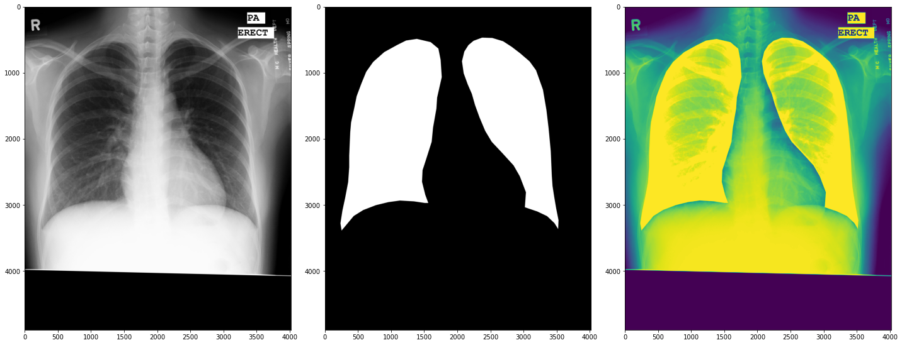
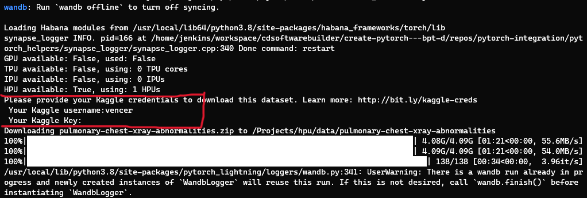
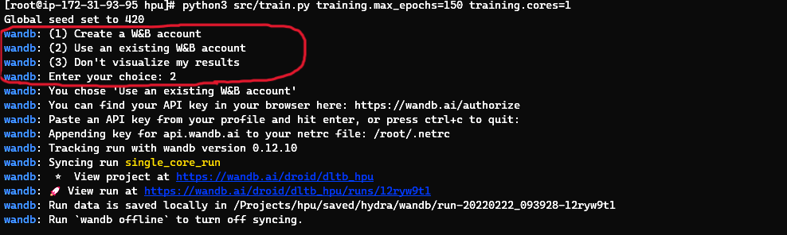
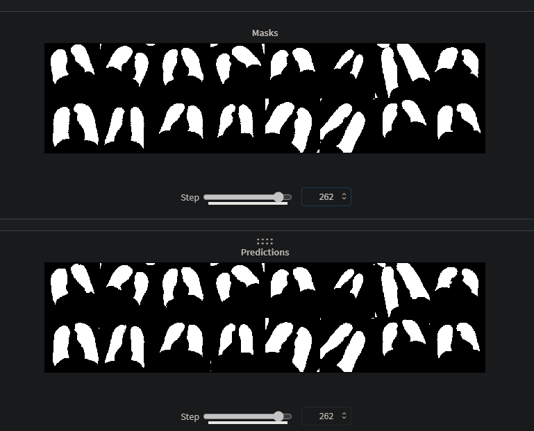
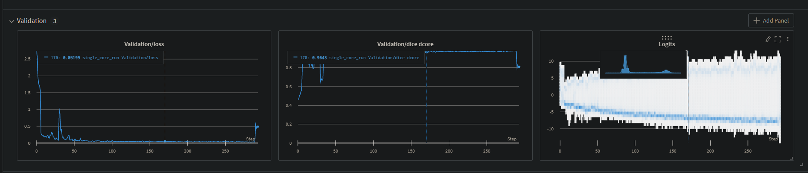

# dtlb on hpu
Lung segmentantion using Montgomery dataset from https://www.ncbi.nlm.nih.gov/pmc/articles/PMC4256233/

Basically training a UNET on Habana Gaudi AI processor(s).

> This is intended as an accompaniment to a TB classification model.

# Getting Started / Setup
The dataset gets pulled from kaggle using opendatasets if it doesn't exist.

Kaggle dataset link: https://www.kaggle.com/kmader/pulmonary-chest-xray-abnormalities.

1. Login into kaggle, head over to the account and get the API token. This is going to needed by open datasets to download the dataset.



2. Clone the repository.

```bash
git clone https://github.com/mrdvince/dltb_hpu
```
3. Install requirements
uncomment out pytorch ligtning from requirements since it's already included in the container.

```bash
pip install -r requirements.txt
```

## Wandb (optional)
Create a W&B account https://wandb.ai/, used for logging and tracking training metrics.
This is optional, if this is not necessary just select option 3 when it comes up.



> Use [DVC](https://dvc.org/) to store models to other storages(preferably S3) since you might exhaust the free 100GB storage provided by W&B (found out the hard way 😂)

### W&B Run
This projects W&B log https://wandb.ai/droid/dltb_hpu

### Masks and model predictions


### Validation loss and dice score


# Training
<p align="center">
  
</p>


Change directory to dltb_hpu, then run:

```bash
python src/train.py training.max_epochs=150 training.cores=1
```

> Using 1 HPU core because i couldn't figure out how to run with all the 8 cores without getting all sorts of errors 😂😂

The extra args are courtesy of [hydra](https://github.com/facebookresearch/hydra), for a full list of overrides add the the -h flag

```bash
(.env9) ➜  hpu git:(master) ✗ python src/train.py -h
Global seed set to 420
train is powered by Hydra.

== Configuration groups ==
Compose your configuration from those groups (group=option)

== Config ==
Override anything in the config (foo.bar=value)

model:
  num_classes: 2
  lr: 0.001
data:
  lung_mask_ds_url: https://www.kaggle.com/kmader/pulmonary-chest-xray-abnormalities
  lm_batch_size: 16
  cl_batch_size: 64
  data_dir: data
  exports_dir: saved/exports
  cxr_dir: data/proc_seg/cxr_pngs
  mask_dir: data/proc_seg/mask_pngs
  lung_mask_raw_dir: data/pulmonary-chest-xray-abnormalities/Montgomery/MontgomerySet/CXR_png
  lung_mask_dim: 256
training:
  max_epochs: 50
  log_every_n_steps: 4
  limit_train_batches: 1.0
  limit_val_batches: 1.0
  save_dir: saved
  deterministic: true
  device: hpu
  num_instances: 1
  bucket_cap_mb: 125
  cores: 8
  patience: 100
  ckpt_every: 10
  run_lazy_mode: false
  skip_first_n_eval: 2
  run_name: single_core_run

Powered by Hydra (https://hydra.cc)
Use --hydra-help to view Hydra specific help
```

# Acknowledgments
```
K Scott Mader. 
2018, March. 
Pulmonary Chest X-Ray Abnormalities, Version 1. 
Retrieved February 2022 from https://www.kaggle.com/kmader/pulmonary-chest-xray-abnormalities.
```